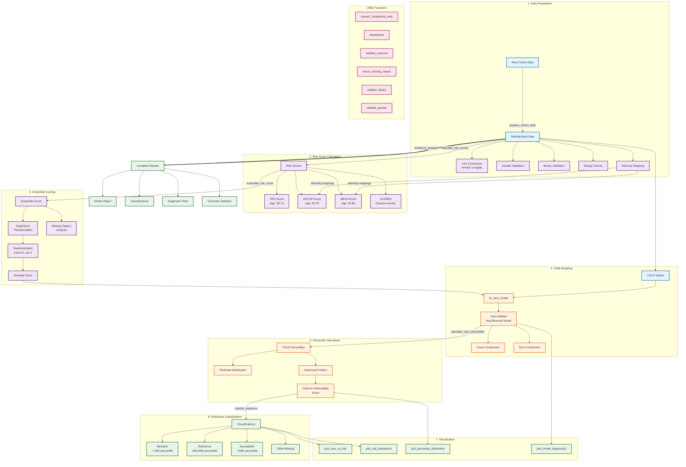

# BioHEART Resilience Analysis Detailed Flowchart

This document contains a detailed flowchart for the BioHEART Resilience Package, showing the key processing steps, data transformations, and important parameters.

## Key Features and Parameters

### Risk Score Specifications
- **FRS**: Ages 30-74, general population risk
- **ASCVD**: Ages 20-79, cholesterol 130-320 mg/dL, requires ethnicity
- **MESA**: Ages 45-85, multi-ethnic cohorts, optional family history
- **SCORE2**: Ages 40-75 optimal, expects mmol/L units, European guidelines

### Model Parameters
- **ZINB Scaling**: Default factor of 100 for numerical stability
- **Ensemble Minimum**: Default 1 valid score required per subject
- **Classification Thresholds**: 20th, 40th, 60th, 80th percentiles (customizable)

### Data Quality Features
- **ID Preservation**: Subject identifiers maintained throughout pipeline
- **Missing Data Handling**: Score-specific warnings and patterns analysis
- **Validation**: Comprehensive range checks and data quality assessment
- **Diagnostics**: Model fit statistics and distributional tests

This flowchart shows the essential workflow while maintaining focus on the key parameters and decision points that users need to understand.
