# BioHEART Resilience Package

[\](https://opensource.org/licenses/MIT)

An R package implementing the BioHEART methodology for cardiovascular disease resilience phenotype classification using coronary artery calcium scores (CACS) and ensemble risk scoring.

## Overview

This package implements the novel methodology described in the BioHEART research for classifying cardiovascular disease resilience phenotypes. It combines multiple cardiovascular risk scores using ordered quantile normalization, fits zero-inflated negative binomial models for CACS prediction, and calculates risk-adjusted CACS percentiles to classify individuals into resilience categories.

## Pipeline Overview

```mermaid
graph LR
    %% Simplified Pipeline Overview
    subgraph "Input"
        A[Raw Data<br/>Demographics, Labs<br/>Risk Factors, CACS]
    end
    
    subgraph "Processing"
        B[Data Preparation<br/>prepare_cohort_data]
        C[Risk Scores<br/>FRS, ASCVD, MESA, SCORE2]
        D[Ensemble Score<br/>OrderNorm + Average]
        E[ZINB Model<br/>Zero-Inflated Modeling]
        F[Percentiles<br/>Risk-Adjusted CACS]
        G[Classification<br/>Resilience Phenotypes]
    end
    
    subgraph "Output"
        H[Results<br/>Classifications + Plots<br/>With ID Preservation]
    end
    
    A --> B --> C --> D --> E --> F --> G --> H
    
    %% Style definitions
    classDef input fill:#e3f2fd,stroke:#1976d2,stroke-width:2px
    classDef process fill:#f3e5f5,stroke:#7b1fa2,stroke-width:2px
    classDef output fill:#e8f5e9,stroke:#388e3c,stroke-width:2px
    
    class A input
    class B,C,D,E,F,G process
    class H output
```



### Detailed Pipeline Steps

1. **Data Preparation**: Validate inputs, convert units, standardize formats
2. **Risk Score Calculation**: Compute FRS, ASCVD, MESA, and SCORE2 scores
3. **Ensemble Scoring**: Combine scores using ordered quantile normalization
4. **ZINB Modeling**: Fit zero-inflated negative binomial model for CACS
5. **Percentile Calculation**: Generate risk-adjusted CACS percentiles
6. **Resilience Classification**: Classify subjects into resilience phenotypes

*For the complete detailed flowchart, see [Flowchart.md](../Flowchart.md)*

## Key Features

- **Multi-Risk Score Integration**: Supports FRS, ASCVD, MESA, and SCORE2 risk calculators
- **Ensemble Scoring**: Uses ordered quantile normalization for risk score combination
- **Zero-Inflated Modeling**: Fits ZINB models for CACS prediction accounting for zero-inflation
- **Resilience Classification**: Classifies individuals as resilient, reference, or susceptible
- **Comprehensive Validation**: Extensive input validation and missing data handling
- **Visualization Tools**: Built-in plotting functions for results interpretation

## Installation

### Development Version

```r
# Install development version from GitHub
if (\!require(devtools)) install.packages("devtools")
devtools::install_github("matthewshu/BioHEARTResilience")
```

### Dependencies

The package requires the following dependencies:
- `stats` (base R)
- `pscl` (>= 1.5.5) - for zero-inflated models
- `bestNormalize` (>= 1.8.0) - for ordered quantile normalization
- `CVrisk` (>= 1.1.0) - for cardiovascular risk scores
- `RiskScorescvd` (>= 0.2.0) - for additional risk scores

## Quick Start

```r
library(BioHEARTResilience)

# Load example data
data("example_cohort")

# Step 1: Prepare cohort data (required first step)
prepared_data <- prepare_cohort_data(
  example_cohort,
  id_col = "subject_id",           # Optional: specify ID column
  cholesterol_unit = "mg/dL",      # Specify cholesterol units
  validate = TRUE                  # Enable data validation
)

# Step 2: Run resilience analysis
results <- resilience_analysis(
  prepared_data,                   # Use prepared data from step 1
  risk_scores = c("frs", "ascvd", "mesa", "score2"),
  min_scores = 2,
  include_plots = TRUE
)

# View resilience classifications
head(results$classifications)

# Access results
print(results)                     # Summary overview
results$final_data                 # Complete results with IDs
results$classifications            # Resilience classifications
```

### With Custom Ethnicity Mappings

```r
# Define custom ethnicity mappings for your cohort
ethnicity_mappings <- data.frame(
  original = c("1", "2", "3", "4", "5"),
  ascvd = c("white", "aa", "other", "aa", "other"),
  mesa = c("white", "aa", "chinese", "aa", "hispanic"),
  stringsAsFactors = FALSE
)

# Run analysis with custom mappings
results <- resilience_analysis(
  prepared_data,
  ethnicity_mappings = ethnicity_mappings,
  risk_scores = c("frs", "ascvd", "mesa"),
  percentile_thresholds = c(resilient = 15, reference_low = 35,
                          reference_high = 65, susceptible = 85)
)
```

## Data Requirements

Your dataset should include:

### Required Columns
- `age`: Age in years
- `gender`: "male"/"female" (or "M"/"F", "1"/"2")
- `tc` or `tc_mgdl`: Total cholesterol
- `hdl` or `hdl_mgdl`: HDL cholesterol
- `sbp`: Systolic blood pressure (mmHg)
- `curr_smok`: Current smoking status (0/1)
- `cvhx_dm`: Diabetes history (0/1)
- `bp_med`: Blood pressure medication (0/1)
- `lipid_med`: Lipid medication (0/1)
- `ethnicity`: Ethnicity for risk score calculation
- `cacs`: Coronary artery calcium score

## Testing

The package includes a comprehensive testing suite with 129 tests achieving 100% pass rate:

```r
# Run all tests
devtools::test()
```

## License

This project is licensed under the MIT License.

## Contributing

Contributions are welcome\! Please feel free to submit a Pull Request.

## Development Status

This package is actively maintained and developed. Current version includes:
- ✅ Complete risk score integration
- ✅ Zero-inflated CACS modeling  
- ✅ Resilience classification
- ✅ Comprehensive testing suite (129 tests, 100% pass rate)
- ✅ Extensive documentation and examples
- ✅ Visualization tools
